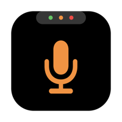
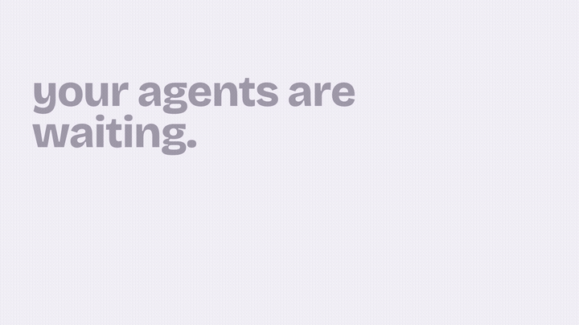

<div align="center">



# NotchControls

**Your notch, on duty.**
Mute anything, prompt yourself, and know the second a coding agent needs you.

[](https://github.com/pratiksardar/di-contorls/releases)
[](#install)
[](LICENSE)
[](CONTRIBUTING.md)
[](Package.swift)



*Your agents are waiting. You might be muted. Your script is showing.*

</div>

---

## Why

It's 2:47 PM. You're on a call, camera on. Behind the meeting window three coding agents are working — and one has been sitting on a permission prompt for twenty minutes. You're also not sure you ever unmuted. **Everything you're anxious about is invisible — and the one part of your screen you look at all day does nothing.**

NotchControls turns the MacBook notch into a cockpit for your work session.

## Features

| | |
|---|---|
| 🎙️ **System-wide mic mute** | Device-level CoreAudio mute — every app (Meet, Slack, Zoom…) goes silent with one click at eye level, or `⌥⇧M` anywhere. Follows you across mic switches. |
| 🤖 **Agent notifications** | Claude Code / Codex banners the second a session needs input or finishes. Click a banner → land in the owning window. Coalesced, per-project mutable, meeting-aware (holds while your mic/camera is live) + quiet hours. |
| 📊 **Live session fleet** | Every `claude`/`codex` session on your machine: working / idle / **needs-you**, project names in stable per-project colors, subagent counts, right-click → open in your editor. |
| 📜 **Invisible teleprompter** | A prompter right under the camera that is **invisible in screen shares and recordings** — Zoom, Meet, OBS see nothing. Drag-to-scrub, live speed keys, font styles, `.md` import. |
| 🗂️ **File shelf** | Drag files onto the notch to stash them; drag them out anywhere later. **AirDrop** any chip, or mirror the shelf to **iCloud Drive** so files appear in the Files app on every device signed into your Apple ID. |
| 📷 **Camera Guard** | Green dot the moment any app opens a camera — and an armable guard that pops an urgent alert the *instant* your camera goes live (even during meetings). |
| 🎛️ **Yours to shape** | Island size (Compact/Standard/Roomy), choose which buttons live in the island, per-module toggles, System/Light/Dark themes, launch at login. MIT, zero dependencies. |

## Install

**[Download the latest release](https://github.com/pratiksardar/di-contorls/releases)** (DMG or zip), or build from source:

```bash
git clone https://github.com/pratiksardar/di-contorls.git && cd di-contorls
make run                                  # build, bundle, launch
build/NotchControls.app/Contents/MacOS/NotchControls install-hooks   # wire Claude Code + Codex (one command, idempotent)
```

Requires macOS 14+. Release builds are ad-hoc signed — **right-click → Open** on first launch.

## The CLI

The app binary doubles as a CLI any tool can call:

```bash
NotchControls notify --agent "My Tool" --kind attention|done --message "…"   # post a banner
NotchControls install-hooks   # wire Claude Code + Codex hooks
NotchControls prompter        # toggle the teleprompter
NotchControls settings        # open settings
```

CI finished? Deploy needs approval? Pipe it to your notch.

## Contributing

PRs are very welcome — see **[CONTRIBUTING.md](CONTRIBUTING.md)** for setup, project layout, and conventions. Good first areas: prompter voice-follow scrolling, quota alerts, exact-tab focus, `.pptx` script import. The full plan lives in [ROADMAP.md](ROADMAP.md); design principles in [PRODUCT.md](PRODUCT.md).

## License

[MIT](LICENSE) © Pratik Sardar
